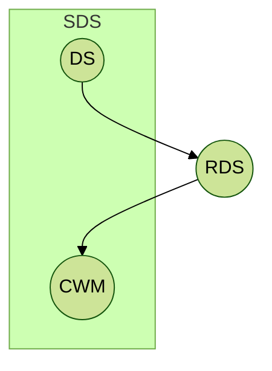

In 1996 I started an online database of coverings designs.
Over the years it grew and changed, from static HTML pages for each
covering, to a MySQL database using PHP, and its current
incarnation using AWS EC2 and RDS instances.  Hundreds of researchers
have contributed tens of thousands of improved coverings over the
years, and I've added databases for circulant weighing matrices and
several types of difference sets, 

After thirty years my databases are being retired.
[The website](http://54.185.214.8/) will continue to be available for
some to-be-determined period, but
there will be no
more changes after March 1, 2026.  The data will remain available;  each database
will be stored on
[github](https://github.com/dmgordo?tab=repositories), with a mirror
at
[zenodo](https://zenodo.org/search?q=metadata.creators.person_or_org.name%3A%22Gordon%2C%20Daniel%20M.%22&l=list&p=1&s=10&sort=bestmatch), as a `json`
file.  Python code and a jupyter notebook are provided to facilitate reading and
processing the data.

The navigation bar at the top of this page leads to descriptions of
each of the combinatorial objects and their databases, but if you just
want to go to one, the links are:

-  [Covering designs](https://zenodo.org/doi/10.5281/zenodo.10779736)
-  [Difference sets](https://zenodo.org/doi/10.5281/zenodo.10775931)
-  [Signed difference sets](https://zenodo.org/doi/10.5281/zenodo.7473882)
-  [Cyclic relative difference sets](https://zenodo.org/doi/10.5281/zenodo.14735633)
-  [Circulant weighing matrices](https://zenodo.org/doi/10.5281/zenodo.10775927)

Each of these databases is being made available under a
[CC BY 4.0](https://creativecommons.org/licenses/by/4.0/) license. You
are free to share and adapt the data any way you like, as long as you
give attribution and indicate what changes have been made.

If you have any issues using one of the databases, or notice any
errors or omissions, please contact me at dmgordo *at* gmail *dot* com.

## Why these combinatorial objects?

The collection of databases may seem random, but aside from covering
designs, they are connected.  The diagram below illustrates this:
difference sets and circulant weighing matrices are both special cases of
signed difference sets.
Relative difference sets may be
constructed by lifting difference sets to a larger group, and
circulant weighing matrices may be constructed from relative
difference sets.  See the pages for each
object and the papers referenced there for more details.

